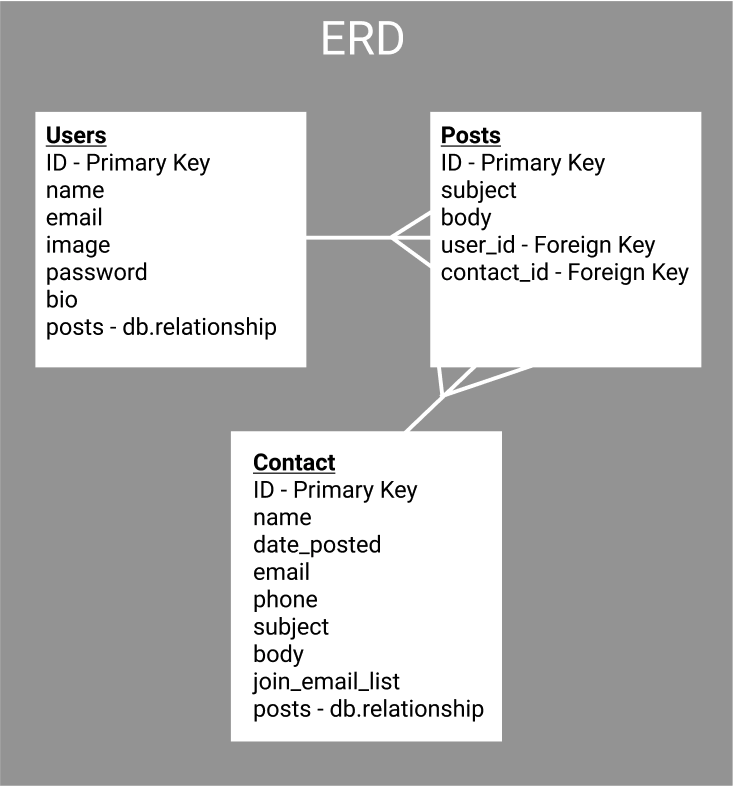

# Get Contacts App
A lightweight CRM built with the Python Full Stack Flask Framework and SQL via Flask-SQLAlchemy.


## Scope
Create a full stack application that serves both potential clients for a small business as well as the business owner for gaining and retaining new leads.

## User Stories
Spa Nirvana Page
- A user can browse what Spa Nirvana has to offer
- A user can enter a contact form to be added to a contact list for someone at Spa Nirvana to reach out to book an appointment.

Admin Page
- A user creates a profile upon signing up.  They can modify that profile with a profile picture, bio, and so forth.
- A user can enter in a contact in to the database
- A user can view all contacts on the admin home page
- A user can view contact messages in detail on a contact detail page.
- A user can edit or delete contact messages
- A user can leave comments for contacts such as "I tried to follow up" etc.  These comments would be seen by other admin users only.  

## ERD


## One Form to Rule Them All
I got excited when experimenting with includes and how Flask renders form fields.  I decided that rather than create multiple form templates to instead make one form template with all the includes that contained conditionals so that only the form fields that applied appeared on the page.  This allowed me to have only one form template.

```html
<form action="" method="POST">
    {{ form.hidden_tag() }}
    
    <!-- Auth Form pt 1 -->
    
    
    <!-- Contact Form -->
    
    
    
    
    <!-- Auth Form pt 2 -->
    
    
    
    
</form>
```

## Next Steps
I was inspired by how minimalist a Flask application can exist therefore I would not want to dump more and more features in to this app.  I would like to add more comments and reply options on the contact pages as well as an option to download the contacts as a CSV.  

## Runtime Language
Python-3.7.7

## Dependencies
- bcrypt==3.2.0
- cffi==1.14.4
- click==7.1.2
- dnspython==2.0.0
- email-validator==1.1.2
- Flask==1.1.2
- Flask-Bcrypt==0.7.1
- Flask-Login==0.5.0
- Flask-SQLAlchemy==2.4.4
- Flask-WTF==0.14.3
- gunicorn==20.0.4
- idna==3.0
- itsdangerous==1.1.0
- Jinja2==2.11.2
- MarkupSafe==1.1.1
- psycopg2==2.8.6
- psycopg2-binary==2.8.6
- pycparser==2.20
- six==1.15.0
- SQLAlchemy==1.3.22
- Werkzeug==1.0.1
- WTForms==2.3.3
